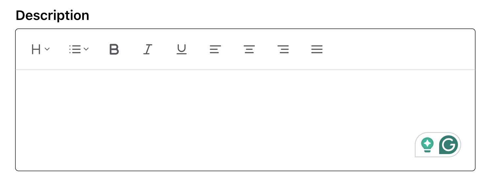

# ShanTiptap 🚁✈️

A modern, feature-rich rich text editor built on top of Tiptap for React/Next.js applications. Designed specifically for job creation forms and professional content management.



## ✨ Features

### 🎯 **Core Functionality**
- **Heading Dropdown** - H1, H2, H3 levels with visual hierarchy
- **List Management** - Bullet lists and ordered lists with proper nesting
- **Text Formatting** - Bold, italic, and underline with keyboard shortcuts
- **Text Alignment** - Left, center, right, and justify alignment options

### 🛠️ **Technical Excellence**
- **SSR Compatible** - Full Next.js App Router support with proper hydration
- **TypeScript First** - Fully typed components and props
- **Modern CSS** - SCSS modules with responsive design
- **Performance Optimized** - Efficient rendering and minimal bundle size

### 🎨 **Professional UI/UX**
- **Tiptap Official Components** - Using official UI component library
- **Consistent Design** - Professional toolbar with proper spacing
- **Visual Feedback** - Active states and hover effects
- **Accessible** - Keyboard navigation and screen reader support

## 🚀 Quick Start

### Installation

```bash
npm install shan-tiptap
# or
yarn add shan-tiptap
```

### Basic Usage

```tsx
import React, { useState } from 'react'
import { Tiptap } from 'shan-tiptap'

function MyComponent() {
  const [content, setContent] = useState('')

  return (
    <Tiptap
      value={content}
      onChange={setContent}
      placeholder="Start typing your content..."
    />
  )
}
```

### Advanced Usage with Job Forms

```tsx
import React, { useState } from 'react'
import { Tiptap } from 'shan-tiptap'

function JobCreateForm() {
  const [jobDescription, setJobDescription] = useState('')
  const [requirements, setRequirements] = useState('')

  return (
    <form>
      <div>
        <label>Job Description</label>
        <Tiptap
          value={jobDescription}
          onChange={setJobDescription}
          placeholder="Describe the job position..."
        />
      </div>
      
      <div>
        <label>Requirements</label>
        <Tiptap
          value={requirements}
          onChange={setRequirements}
          placeholder="List the requirements..."
        />
      </div>
    </form>
  )
}
```

## 📋 API Reference

### Props

| Prop | Type | Default | Description |
|------|------|---------|-------------|
| `value` | `string` | `''` | The HTML content of the editor |
| `onChange` | `(content: string) => void` | `undefined` | Callback fired when content changes |
| `placeholder` | `string` | `'Start typing...'` | Placeholder text when editor is empty |

### Toolbar Components

#### HeadingDropdownMenu
- **H1**: Large heading (1.4rem)
- **H2**: Medium heading (1.2rem) 
- **H3**: Small heading (1.1rem)

#### ListDropdownMenu
- **Bullet List**: Unordered lists with disc bullets
- **Ordered List**: Numbered lists with decimal numbering

#### MarkButtons
- **Bold**: `Ctrl/Cmd + B`
- **Italic**: `Ctrl/Cmd + I`
- **Underline**: `Ctrl/Cmd + U`

#### TextAlignButtons
- **Left Align**: Default text alignment
- **Center Align**: Center text alignment
- **Right Align**: Right text alignment
- **Justify**: Justified text alignment

## 🏗️ Architecture

### Component Structure
```
ShanTiptap/
├── TipTap.tsx              # Main component export
├── MenuBar.tsx             # Editor with toolbar
├── MenuBar.module.scss     # Styling
├── tiptap-ui/              # UI components
│   ├── heading-dropdown-menu/
│   ├── list-dropdown-menu/
│   ├── text-align-button/
│   └── mark-button/
├── tiptap-ui-primitive/    # Base UI primitives
│   ├── button/
│   ├── dropdown-menu/
│   └── tooltip/
├── tiptap-icons/           # Icon components
└── tiptap-node/           # Node styling
    ├── paragraph-node/
    └── code-block-node/
```

### Extensions Used
- **@tiptap/starter-kit** - Core functionality
- **@tiptap/extension-underline** - Underline support
- **@tiptap/extension-text-align** - Text alignment
- **@tiptap/extension-task-list** - Task list support
- **@tiptap/extension-color** - Text color support

## 🎯 Use Cases

### ✈️ Aviation Industry
- **Job Descriptions** - Rich formatting for aviation job postings
- **Requirements Lists** - Structured requirement documentation
- **Company Profiles** - Professional company descriptions
- **Training Materials** - Educational content creation

### 💼 General Business
- **Content Management** - Blog posts and articles
- **Documentation** - Technical documentation
- **Forms** - Rich text form fields
- **Messaging** - Enhanced messaging systems

## 🛠️ Development

### Prerequisites
- Node.js 16+
- React 18+ or 19+
- Next.js 14+ or 15+

### Local Development

```bash
# Clone the repository
git clone https://github.com/ShahanurSharif/ShanTiptap.git
cd ShanTiptap

# Install dependencies
npm install

# Start development
npm run dev
```

### Building

```bash
# Build for production
npm run build

# Type checking
npm run type-check
```

## 🎨 Customization

### Styling
The editor uses SCSS modules for styling. You can override styles by importing and extending the base styles:

```scss
// Your custom styles
.custom-editor {
  .tiptap {
    min-height: 200px;
    
    h1 { font-size: 2rem; }
    h2 { font-size: 1.5rem; }
    
    ul { list-style-type: square; }
  }
}
```

### Extensions
Add custom Tiptap extensions by modifying the extensions array:

```tsx
import { CustomExtension } from 'your-extension'

// In MenuBar.tsx extensions array
const extensions = [
  // ...existing extensions
  CustomExtension.configure({
    // your configuration
  })
]
```

## 📱 Browser Support

- **Chrome** 88+
- **Firefox** 85+
- **Safari** 14+
- **Edge** 88+

## 🤝 Contributing

1. Fork the repository
2. Create your feature branch (`git checkout -b feature/amazing-feature`)
3. Commit your changes (`git commit -m 'Add amazing feature'`)
4. Push to the branch (`git push origin feature/amazing-feature`)
5. Open a Pull Request

## 📄 License

This project is licensed under the MIT License - see the [LICENSE](LICENSE) file for details.

## 🙏 Acknowledgments

- **[Tiptap](https://tiptap.dev/)** - The excellent headless editor framework
- **[Next.js](https://nextjs.org/)** - The React framework for production
- **[React](https://react.dev/)** - The library for web user interfaces

## 📞 Support

- 🐛 **Bug Reports**: [GitHub Issues](https://github.com/ShahanurSharif/ShanTiptap/issues)
- 💡 **Feature Requests**: [GitHub Discussions](https://github.com/ShahanurSharif/ShanTiptap/discussions)
- 📧 **Linkedin**: [Linkedin](https://www.linkedin.com/in/shahanursharif)

---

**Built with ❤️ for job creation form by [ShahanurSharif](https://github.com/ShahanurSharif)**
